# OneMenu (IN PROGRESS)

**OneMenu** is a collaborative meal planning app designed to help users create a shared menu  
by allowing invited guests to vote on various starters, main courses, desserts, and more.  
An optimization algorithm processes all the votes and selects the menu that  
**maximizes overall satisfaction** across the group — ideal for events, dinners, and parties.

## Features

- Create voting sessions for menus
- Invite guests to participate
- Choose from multiple dishes (starters, mains, desserts, etc.)
- Intelligent algorithm picks the best global combination
- User authentication & session management
- Mobile-first frontend experience

## Tech Stack

| Layer      | Technology        |
|------------|-------------------|
| Frontend   | Angular            |
| Backend    | Express.js (TypeScript) |
| Database   | PostgreSQL         |
| Deployment | Docker + Render    |

## Project Structure

```bash
OneMenu/
├── backend/        # Express + TypeScript API
├── frontend/       # Angular SPA
└── database/       # SQL scripts
```

## Screenshots

### Home

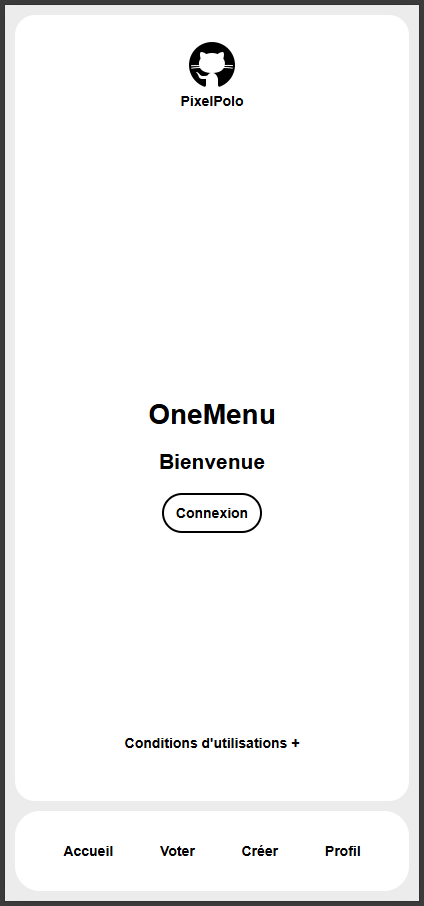
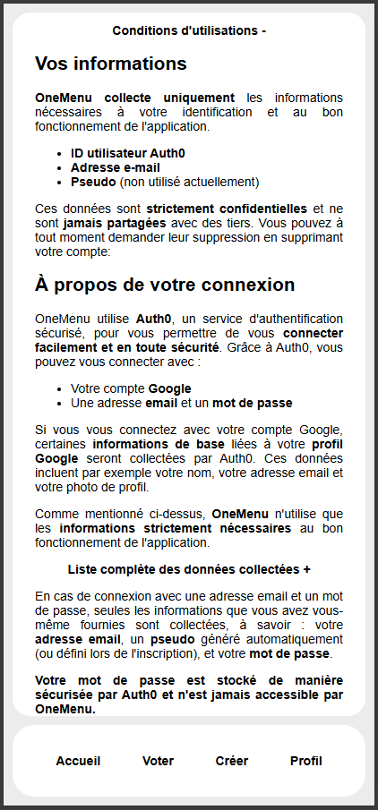

### Welcome

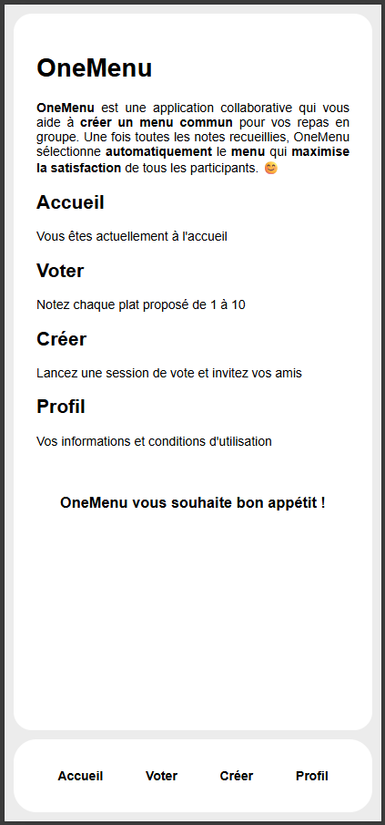

### Vote and results

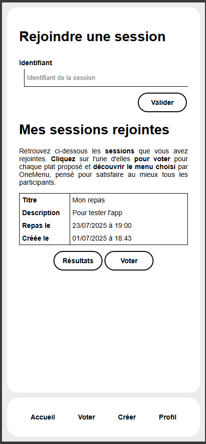
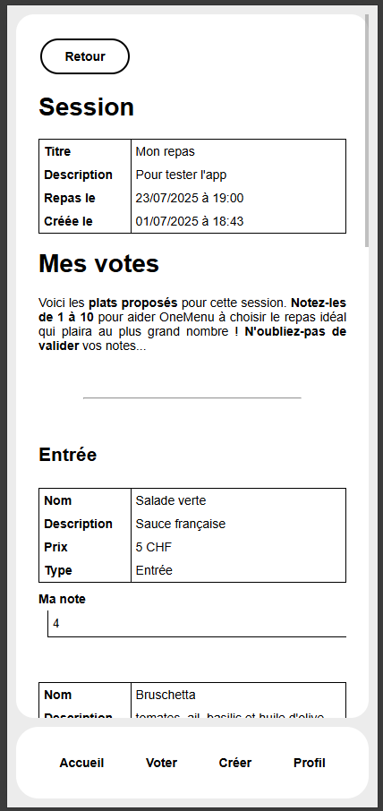
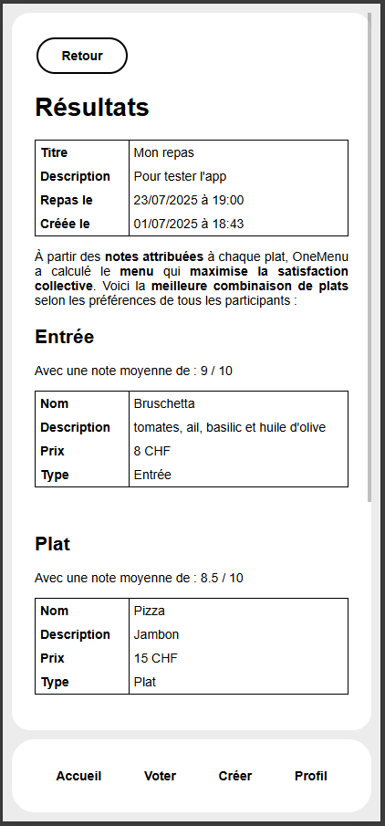
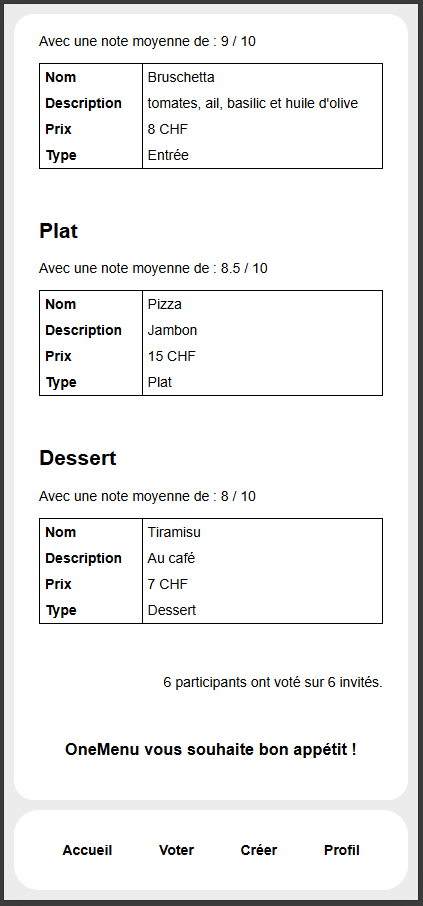

### Create and edit

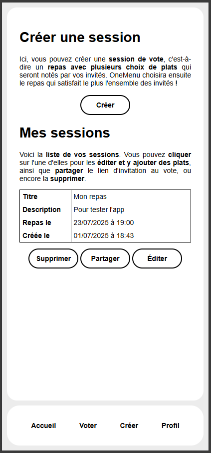
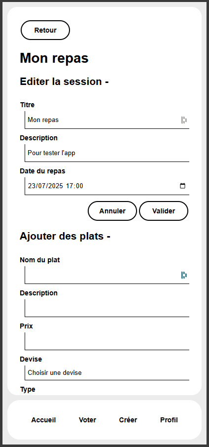
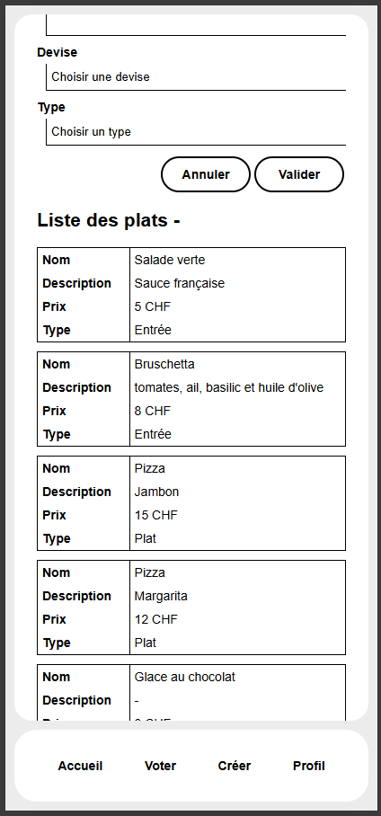

### Profile and terms

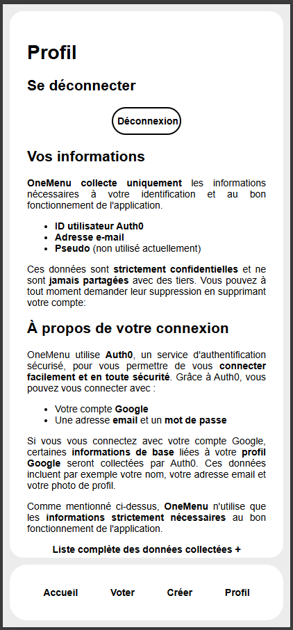
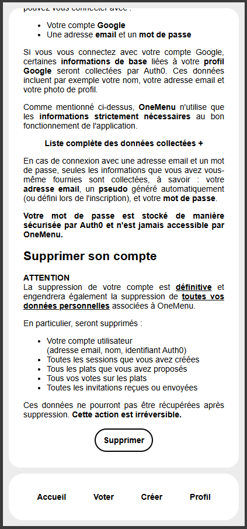
